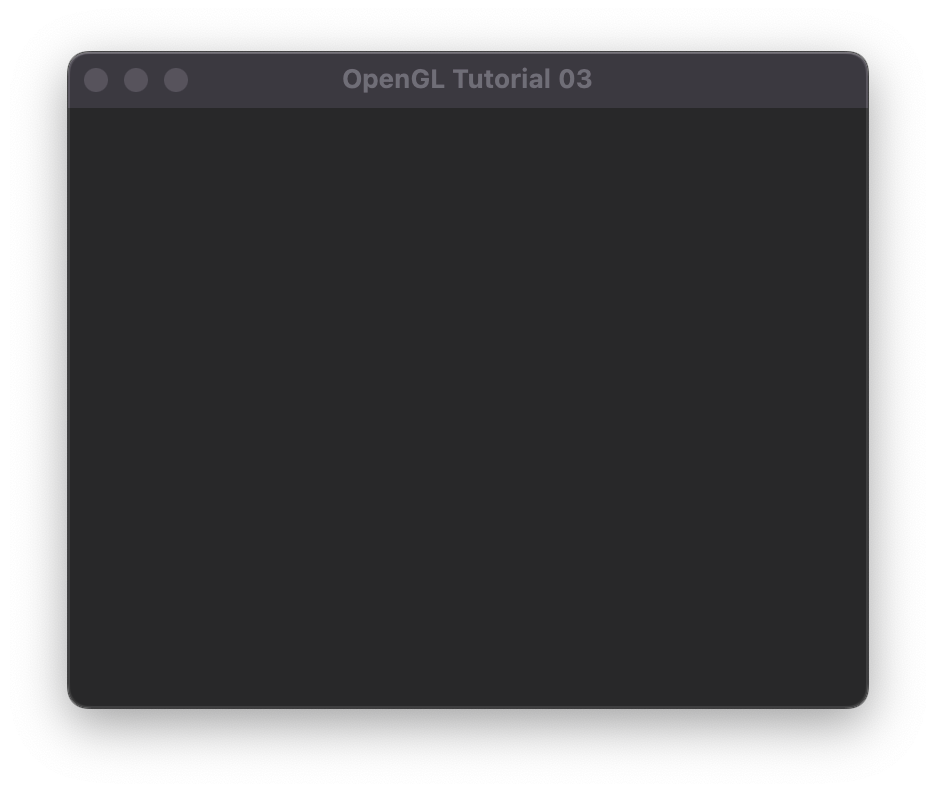
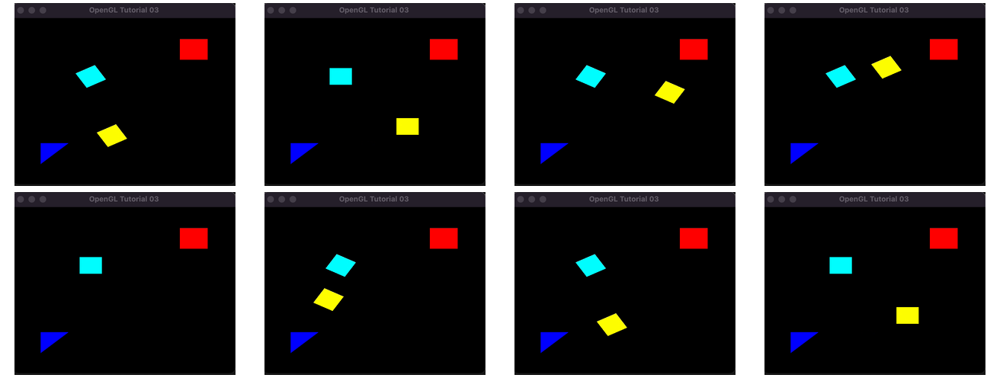

# U03 - OpenGL Intro

Das Ziel der ersten Übung ist es, Sie mit der prinzipiellen Funktion von OpenGL vertraut zu machen. Dazu müssen Sie im Grunde genommen die Source-Dateien nur zu einer ausführbaren Datei kompilieren - das sollte für angehende Informatiker kein Problem darstellen.

Wenn Sie das geschafft haben sollte das beim Ausführen dann in etwa so aussehen - ein leeres Fenster.



Fügen Sie an der gekennzeichneten Stelle Ihre eigenen Befehle ein! Hier sehen Sie einen möglichen Output dieser Prozedur:

1) ein statisches blaues Dreieck
2) ein statisches rotes Rechteck
3) ein um sich selbst rotierendes hellblaues Rechteck
4) ein um das Zentrum rotierendes gelbes Rechteck.



Das stellt auch so in etwa das Minimalziel der Übung dar. Ein paar Anmerkungen:

- Sie sind herzlich eingeladen, sowohl die Befehle für Polygone (```GL_POLYGON```), als auch für Dreiecke (```GL_TRIANGLES```) zu verwenden.
- Verwenden Sie verschiedene Farben!
- Denken Sie an die Reihenfolge der Befehle! Vertauschen Sie die Reihenfolge der Befehle für die Translation und Rotation erhalten Sie ein anderes Ergebnis!
- Wissen Sie nicht weiter? OpenGL Programming Guide konsultieren, oder alternativ Youtuben und Googlen...

Viel Spaß!
