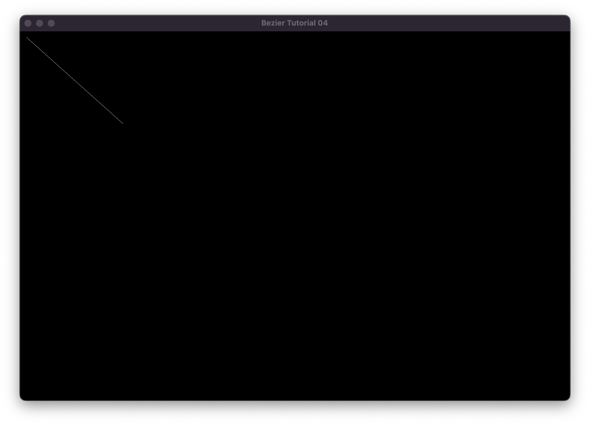
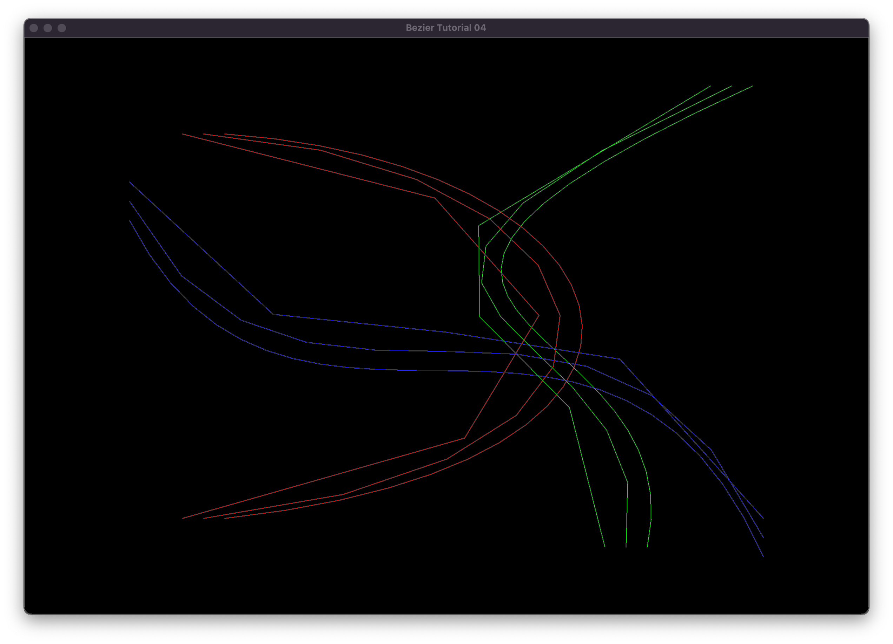

# U04 - Bezier Curves

Das Ziel der zweiten Übung ist es, eine oder mehrere Kurven in 2D nach dem Bezier oder Casteljau Prinzip zu zeichnen. Dazu müssen Sie im Grunde genommen die Source-Dateien nur zu einer ausführbaren Datei kompilieren, um zur Ausgangsposition zu kommen.

Wenn Sie das geschafft haben sollte das beim Ausführen dann in etwa so aussehen - ein Fenster mit einer einfachen Linie, definiert durch 2 Punkte in der Farbe weiss.

Fügen Sie an der jeweiligen Stelle Ihre eigenen Befehle ein! Hier sehen Sie den möglichen Output einer (bereits etwas fortgeschrittenen) Prozedur:

1) drei rote Kurven
2) drei grüne Kurven
3) drei blaue Kurven

Diese Kurven wurden mit unterschiedlichen Parametern für $\Delta$t erstellt. Die gröbste Kurve enthält nur 4 Segmente, die etwas smoothere Kurve 8 Segmente und die "schöne" Kurve 15 Segmente.

Haben Sie das Konzept verstanden, dann spielen Sie mit der Anzahl der Segmente, um verschiedene Kurven zu zeichnen.

Ein paar Anmerkungen:

- Sie sind herzlich eingeladen, mehr als nur eine Kurve zu zeichnen.
- Verwenden Sie verschiedene Farben!
- Schreiben Sie sich eine Funktion, die verschiedene Parameter übernimmt und Ihnen dann einen Array von Vertices auf der Kurve zurückgibt - das macht Ihnen das Leben beim "Herumspielen" wesentlich einfacher.
- Wissen Sie nicht weiter? Youtuben und Googlen hilft...

Viel Spaß!
