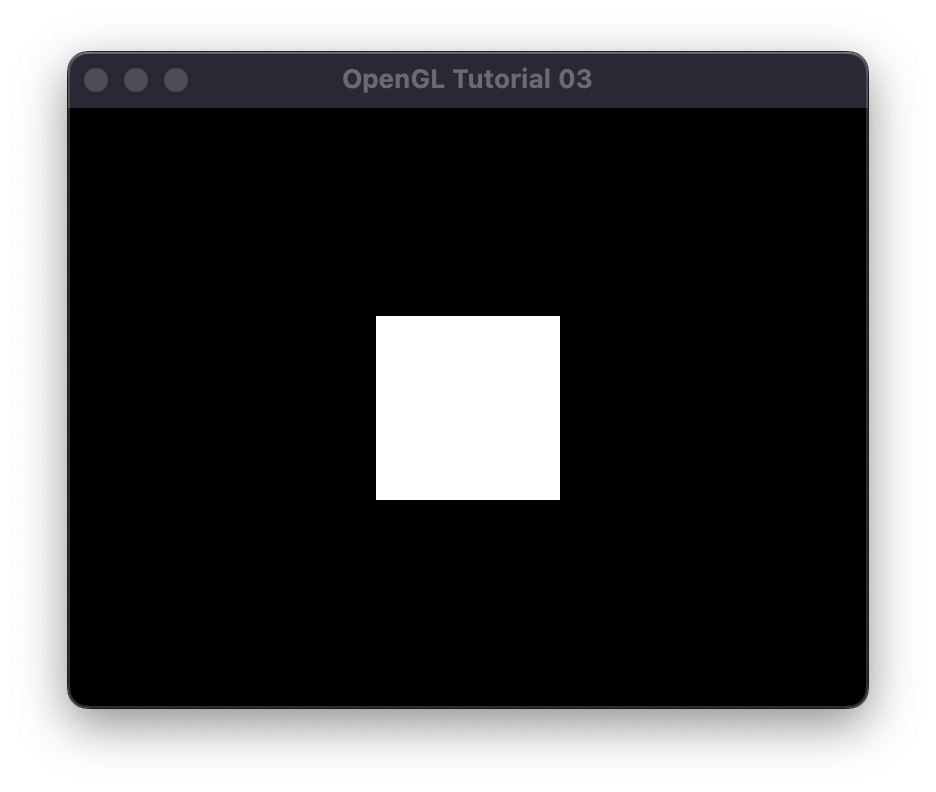
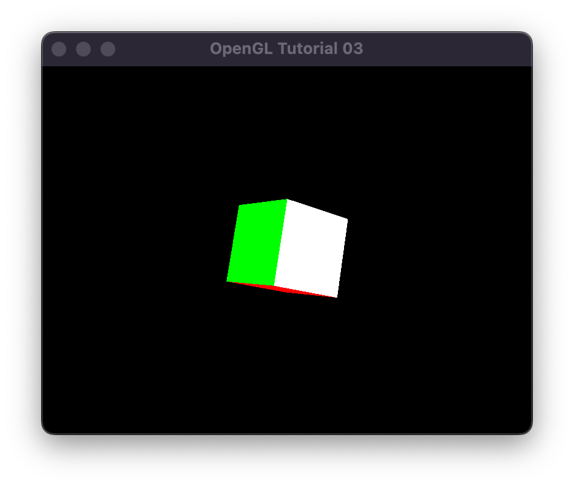
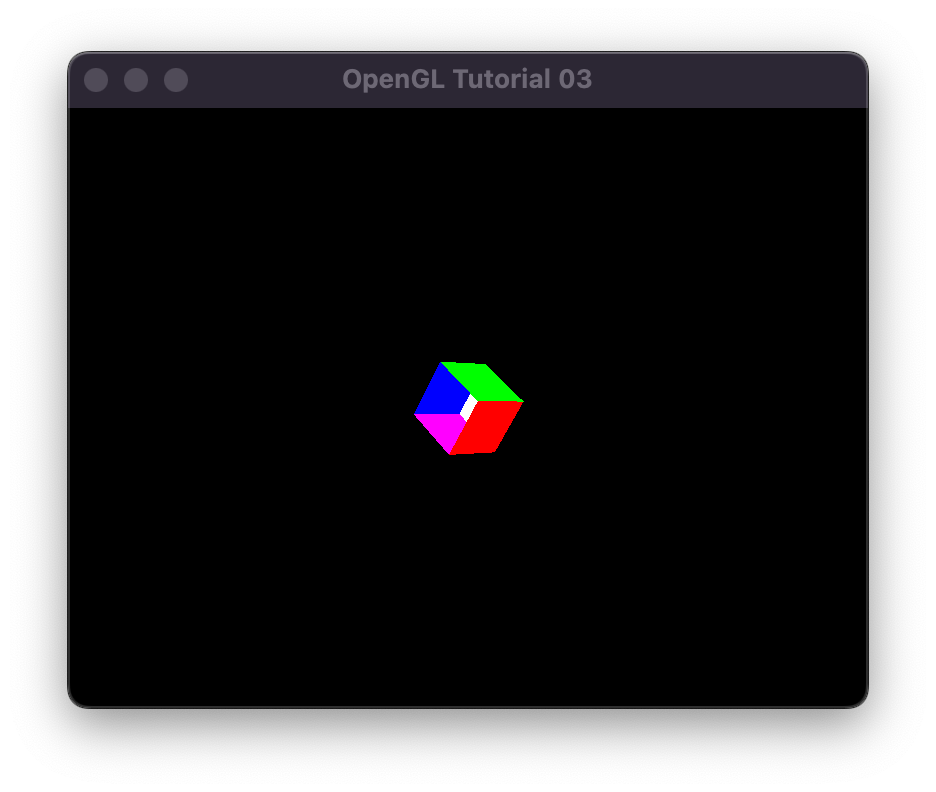
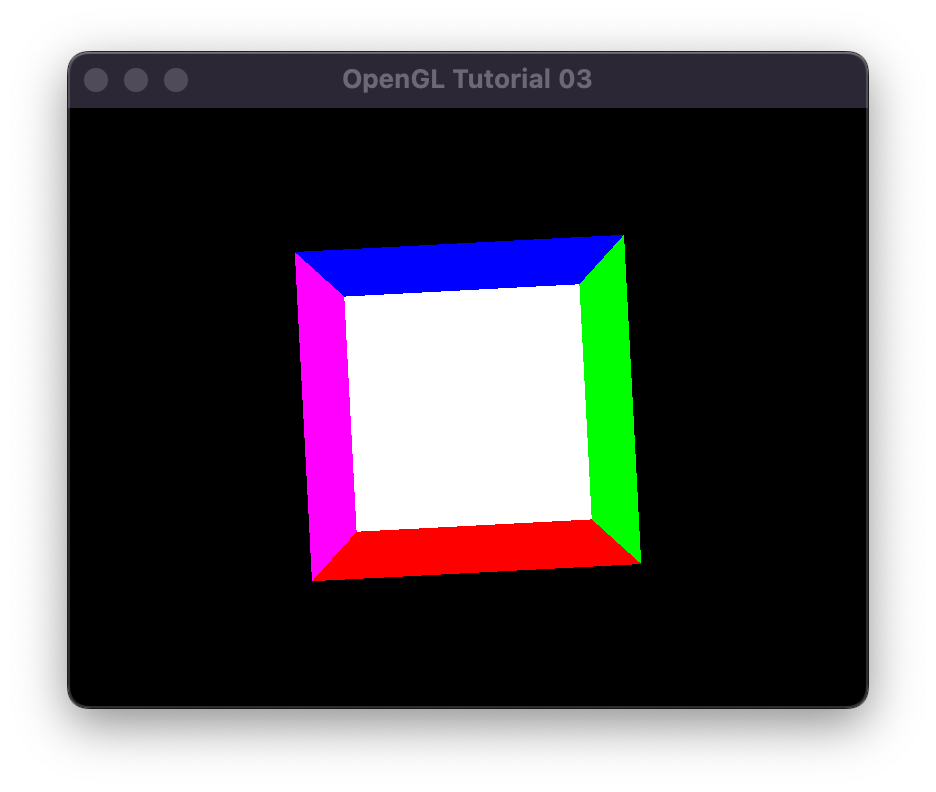
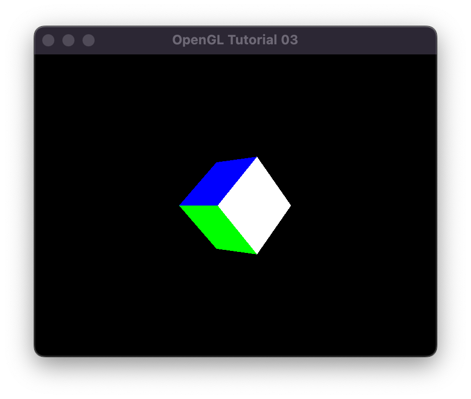
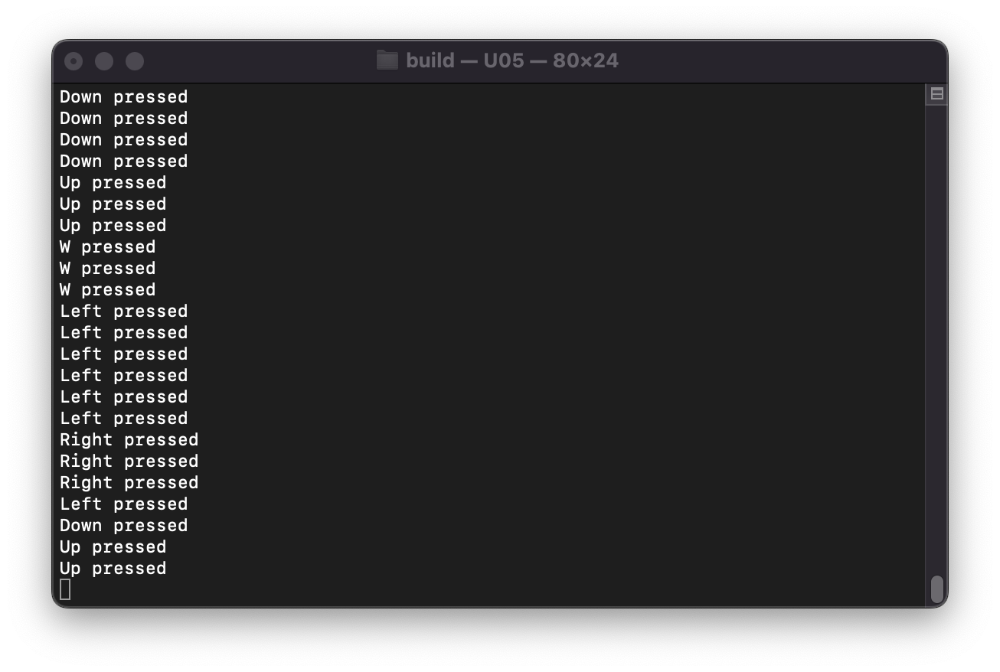

# U05 - Kamerabewegung in der Szene

Das Ziel der dritten Übung ist es, eine Kamera in einer Szene zu positionieren und mittels Keyboard- oder Mauseingabe in der Szene herumzubewegen. Dazu müssen Sie im Grunde genommen die Source-Dateien nur zu einer ausführbaren Datei kompilieren, um zur Ausgangsposition zu kommen.

Wenn Sie das geschafft haben sollte das beim Ausführen dann in etwa so aussehen - ein Fenster mit einem weissen Viereck, das tatsächlich die obere Seite einer unten offenen Box ist (sehen Sie sich den Code im Script dazu an).

Fügen Sie an der jeweiligen Stelle Ihre eigenen Befehle ein! Hier sehen Sie den möglichen Output einer (bereits etwas fortgeschrittenen) Prozedur:

In der Konsole sollten Sie die Mausbewegungen oder Tastenanschläge entsprechend wiederfinden. Hier als Beispiel eine beliebige Abfolge:

Haben Sie das Konzept verstanden, dann spielen Sie sich ein bißchen damit herum.

Ein paar Anmerkungen:

- Lesen Kapitel 3 des Programming Guides - da sollten Sie alle Infos finden.
- https://learnopengl.com/Getting-started/Camera könnte auch hilfreich sein.
- Seien Sie kreativ. Sie können die Tastenbelegung nach Ihren wünschen ändern, um die Kamera zu steuern.
- Wenn Sie sehr motiviert sind (und Übung U03 verstanden haben), können Sie versuchen die Szene selber ebenfalls zu verändern, also den Würfel selber z.B. rotieren, skalieren oder translieren.
- Wissen Sie nicht weiter? Youtuben und Googlen hilft...

Viel Spaß!
