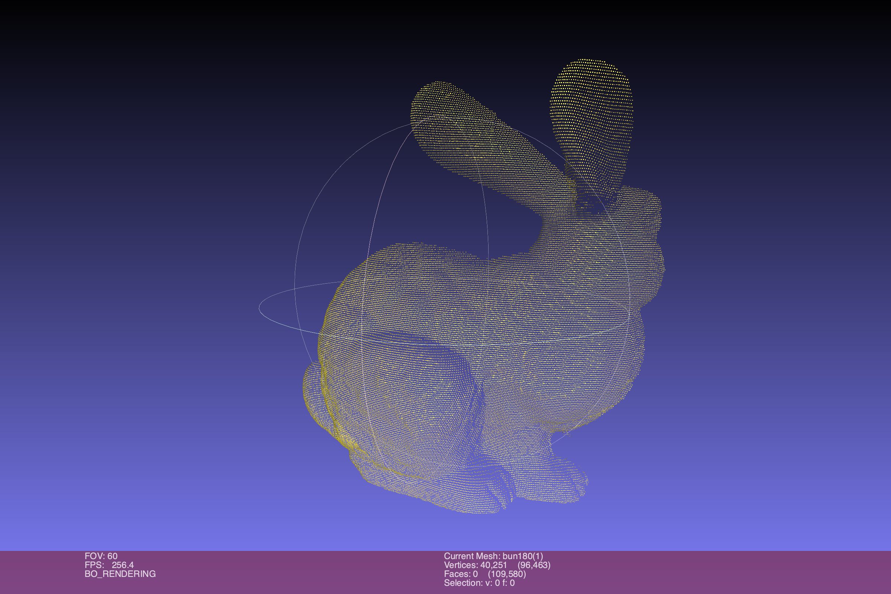
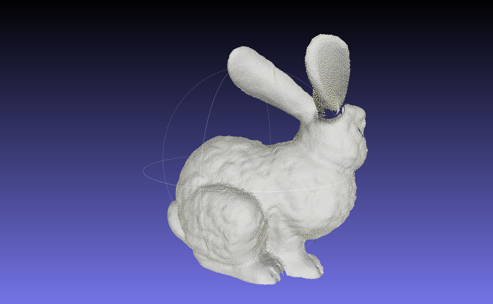
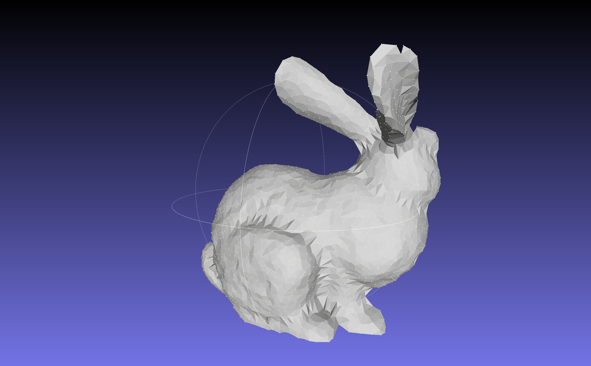

# U06 - Mesh-Generation aus einer Punktwolke

Das Ziel der vierten Übung ist es, eine Punktwolke in Meshlab mittels verschiedener Funktionen in ein Triangle-Mesh überzuführen. Dazu müssen Sie zunächst [Meshlab](https://www.meshlab.net) installieren.

Wenn Sie das geschafft haben, entpacken Sie das ZIP file im Ordner (```bun180.ply.zip```) und laden die Punktwolke in Meshlab. Das sollte dann ungefähr so aussehen:



Folgen Sie den Anweisungen in [diesem Youtube Video](https://www.youtube.com/watch?v=gDFRUPK-eIc), um das Objekt zu triangulieren.

Experimentieren Sie mit den Funktionen anhand der Erklärung in dem Video herum und versuchen Sie, ein **geschlossenes** Modell zu generieren (speziell an den Beinen des Hasen).



Haben Sie das Konzept verstanden, dann spielen Sie sich mit der Anzahl der Vertices herum (Poisson Sampling) um ein Gefühl für den Tradeoff "Ästhetik vs. Komplexität" zu erhalten. Denken Sie daran, daß Ihre Anforderungen an die "Schönheit" Ihres Modells je nach Anwendung (mobile game oder photorealitic video compositing) stark variieren können.



Ein paar Anmerkungen:

- Sie sind auch herzlich eingeladen, ein beliebiges anderes Modell zu triangulieren. Laden Sie sich z.B. von [TurboSquid](https://www.turbosquid.com/) ein Modell im OBJ format herunter, löschen Sie die Texturen und Faces - dann bleiben nur mehr die Punkte als Wolke über.
- Wissen Sie nicht weiter? Youtuben und Googlen hilft...

Viel Spaß!
