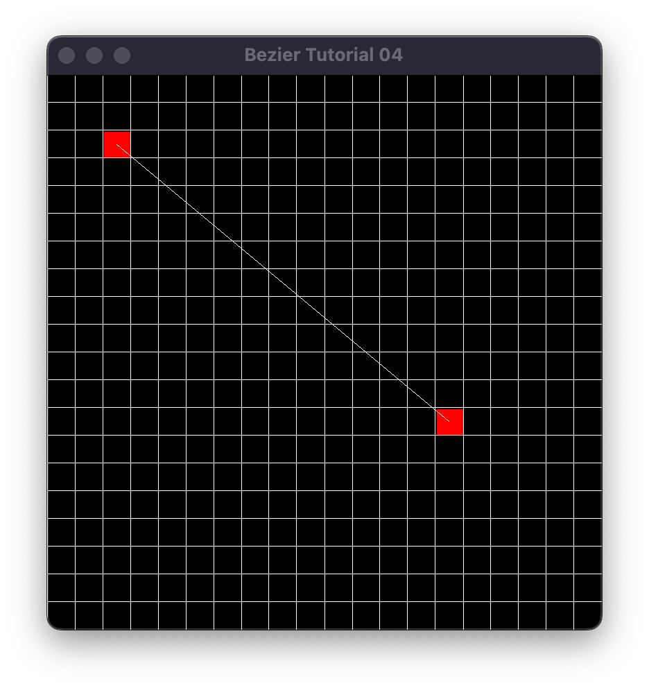
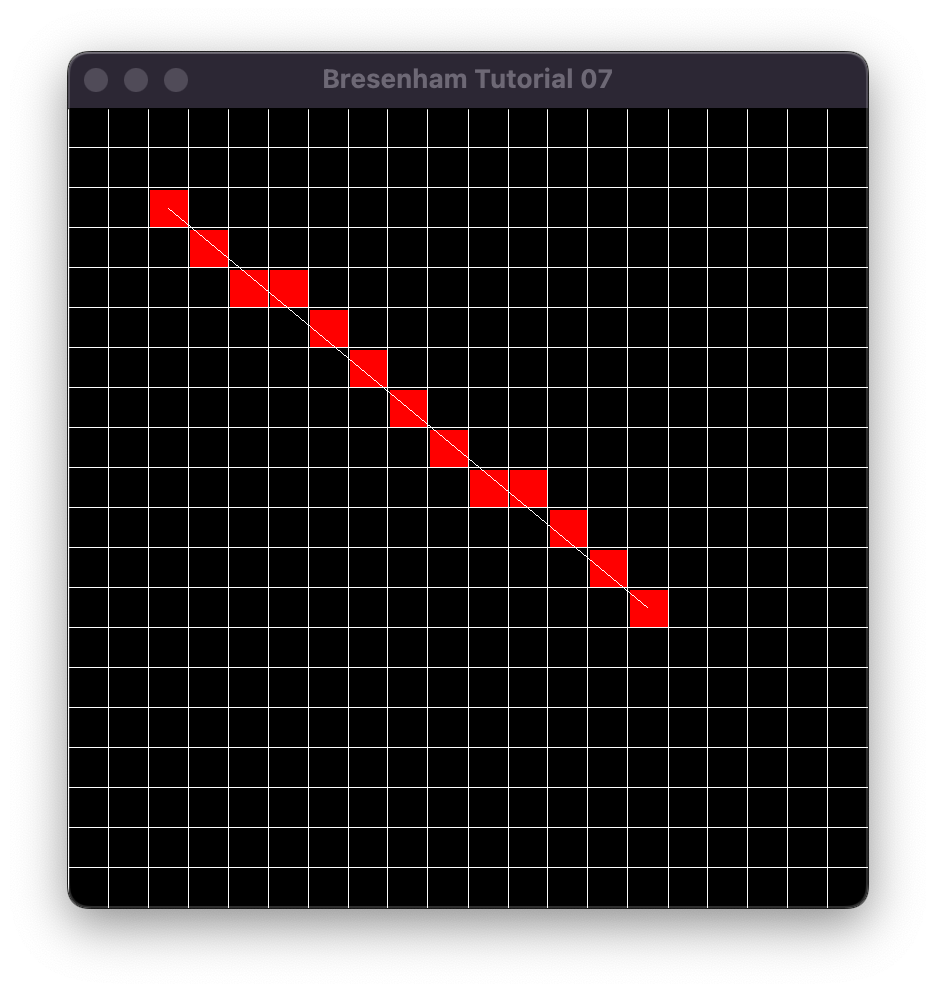

# U07 - Bresenham Algorithmus

Das Ziel dieser Übung ist es, den Bresenham Algorithmus zu verstehen und anhand eines einfachen Beispiels anzuwenden. Dazu müssen Sie im Grunde genommen die Source-Dateien nur zu einer ausführbaren Datei kompilieren, um zur Ausgangsposition zu kommen.

Wenn Sie das geschafft haben sollte das beim Ausführen dann in etwa so aussehen - ein Fenster mit einem Raster, zwei rot markierten Punkten (dem Anfangs- und Endpunkt einer Line) und der Line dazwischen (sehen Sie sich den Code im Script dazu an).

Fügen Sie an der jeweiligen Stelle Ihre eigenen Befehle ein! Hier sehen Sie das zu erzielende Ergebnis mit den eingefärbten Punkten entlang der Linie.

Haben Sie das Konzept verstanden, dann spielen Sie sich ein bißchen damit herum.

Ein paar Anmerkungen:

- Wenn Sie sehr motiviert sind, können Sie versuchen verschiedene Linien zu zeichnen.
- Wissen Sie nicht weiter? Youtuben und Googlen hilft...

Viel Spaß!
