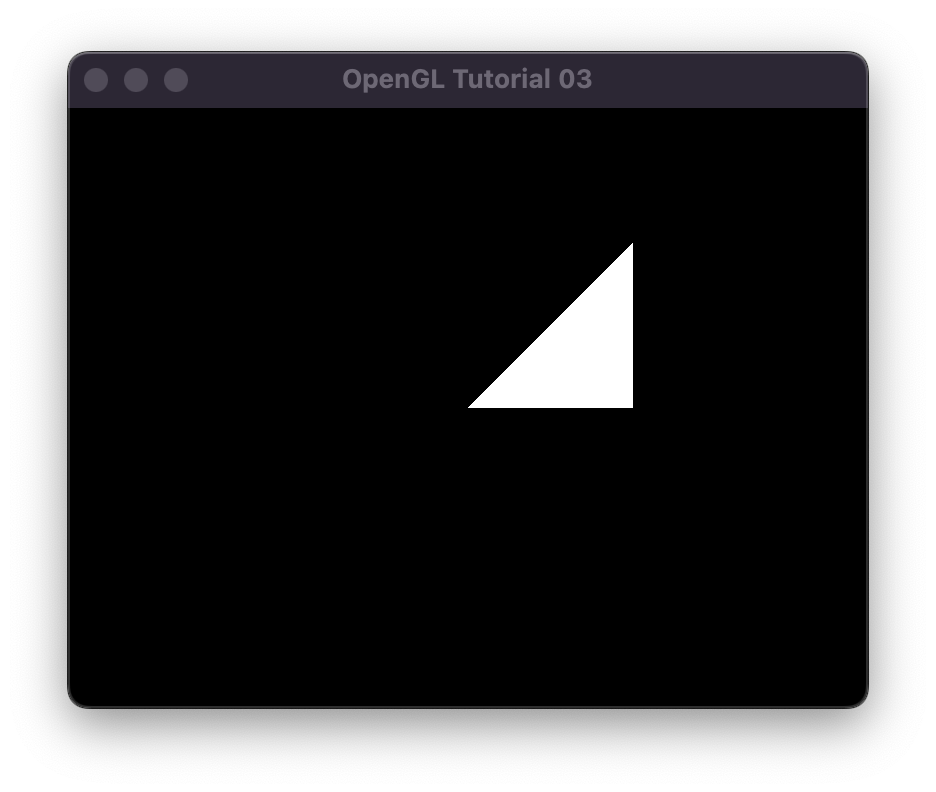
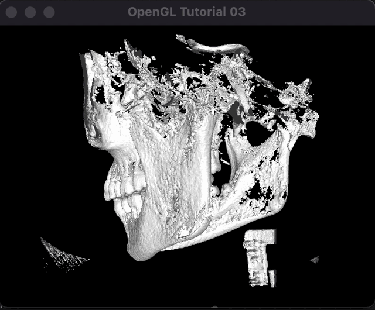

# U08 - Marching Cubes

Das Ziel dieser Übung ist es, den Marching Cube Algorithmus zu verstehen und anhand eines einfachen Beispiels anzuwenden. Dazu müssen Sie im Grunde genommen die Source-Dateien nur zu einer ausführbaren Datei kompilieren, um zur Ausgangsposition zu kommen.

Wenn Sie das geschafft haben sollte das beim Ausführen dann in etwa so aussehen - ein Fenster mit einem einfachen Dreieck.



Im Source code enthalten ist das ```Header```file mit dem LUT zur Einordnung der mit binärcodes versehenen einzelnen cubes:

```
//marching cubes table data
int edgeTable[256]={
0x0  , 0x109, 0x203, 0x30a, 0x406, 0x50f, 0x605, 0x70c,
0x80c, 0x905, 0xa0f, 0xb06, 0xc0a, 0xd03, 0xe09, 0xf00,
0x190, 0x99 , 0x393, 0x29a, 0x596, 0x49f, 0x795, 0x69c,
...
};

char triTable[256][16] =
{{-1, -1, -1, -1, -1, -1, -1, -1, -1, -1, -1, -1, -1, -1, -1, -1},
{0, 8, 3, -1, -1, -1, -1, -1, -1, -1, -1, -1, -1, -1, -1, -1},
{0, 1, 9, -1, -1, -1, -1, -1, -1, -1, -1, -1, -1, -1, -1, -1},
...
};
```
Nutzen Sie diese Datei in Ihrer eigenen Implementierung. Fügen Sie an der jeweiligen Stelle Ihre eigenen Befehle ein! Hier sehen Sie das zu erzielende Ergebnis mit einem definierten Isosurface-Value von ```50```.



Haben Sie das Konzept verstanden, dann spielen Sie sich ein bißchen damit herum.

Ein paar Anmerkungen:

- Wenn Sie sehr motiviert sind, können Sie versuchen verschiedene andere Datensätze zu verarbeiten.
- Wissen Sie nicht weiter? Youtuben und Googlen hilft...

Viel Spaß!
